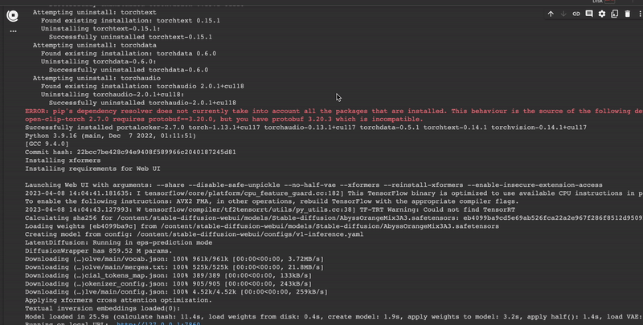

# stable-diffusion-webui-colab

Running stable Diffusion Web UI on Google Colab notebooks.

# Usage

- Run [`stable_diffusion_v1_5_webui_colab.ipynb`][stable_diffusion_v1_5_webui_colab][![Open In Colab][colab-badge]][stable_diffusion_v1_5_webui_colab]
- Run [`stable_diffusion_XL_v1_0_webui_colab.ipynb`][stable_diffusion_XL_v1_0_webui_colab][![Open In Colab][colab-badge]][stable_diffusion_XL_v1_0_webui_colab]

[stable_diffusion_v1_5_webui_colab]: https://colab.research.google.com/github/cyruslauwork/stable-diffusion-webui-colab/blob/master/stable_diffusion_v1_5_webui_colab.ipynb
[stable_diffusion_XL_v1_0_webui_colab]: https://colab.research.google.com/github/cyruslauwork/stable-diffusion-webui-colab/blob/master/stable_diffusion_XL_v1_0_webui_colab.ipynb
[colab-badge]: https://colab.research.google.com/assets/colab-badge.svg

Click on the Gradio.live public URL in the finale code cell output:


# Suggested Setting

- Prompt

```bash
best quality, masterpiece, extremely delicate and beautiful, extremely detailed, CG, unity, 8k wallpaper, absurd-res, huge filesize,

1girl, extremely detailed eyes and face, maid clothes, smile,
```

- Negative Prompt

```bash
NSFW, nude, naked, sex, sketches, (worst quality:2), (low quality:2), (normal quality:2), lowres, normal quality, ((monochrome)), ((grayscale)), skin spots, acnes, skin blemishes, bad anatomy, (long hair:1.4), DeepNegative, (fat:1.2), facing away, looking away, tilted head, lowres, bad anatomy, bad hands, text, error, missing fingers, extra digit, fewer digits, cropped, username, blurry, bad feet, cropped, poorly drawn hands, poorly drawn face, mutation, deformed, worst quality, low quality, normal quality, jpeg artifacts, signature, watermark, extra fingers, fewer digits, extra limbs, extra arms, extra legs, malformed limbs, fused fingers, too many fingers, long neck, cross-eyed, mutated hands, polar lowres, bad body, bad proportions, gross proportions, text, error, missing fingers, missing arms, missing legs, extra digit, extra arms, extra leg, extra foot,
```


